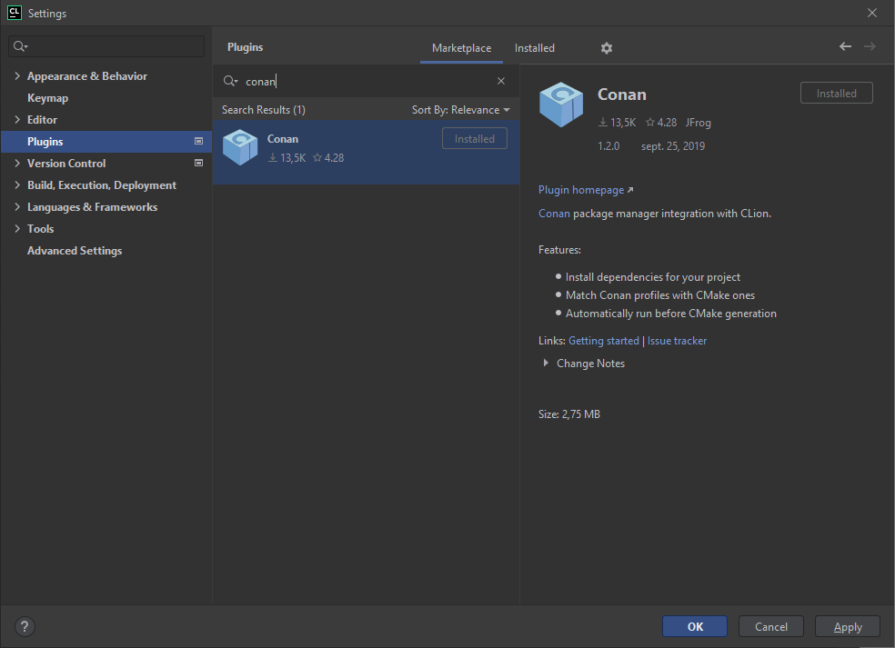
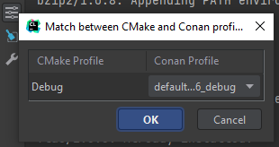
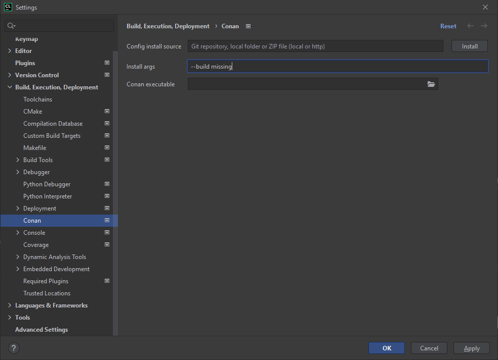

# Conan Example

Example project to use Conan as C++ dependencies manager.

## Docs

* Conan's resources: https://conan.io/
* Install on CLion: https://blog.jetbrains.com/clion/2019/05/getting-started-with-the-conan-clion-plugin/

## Basic setup on Windows and CLion

### Install Conan binary

Install CLion by downloading the binary installation: https://conan.io/downloads.html

Or use the pip command: 

```bash
pip install conan
```

### Generate Conan profiles

Conan profiles needs to be generated and placed in the directory `~/.conan/profiles/`. They could be generated with the following command:

```bash
conan profile new --detect default
```

Do not forget to tweak the values "arch", "arch_build" and "build_type".

Example file:

```text
[settings]
os=Windows
os_build=Windows
arch=x86
arch_build=x86
compiler=Visual Studio
compiler.version=16
build_type=Release
[options]
[build_requires]
[env]
```

### Install the plugin in CLion



### Link profiles with builds

It is needed to link the profiles files with the CMake profiles in the plugin configuration:



### Create conanfile.txt

Create a conanfile.txt at the root path of the project containing the dependencies.

For example:

```text
[requires]
spdlog/1.9.2
sfml/2.5.1

[generators]
cmake
```

### Configure cmake

Add the required elements to obtain a `CMakeLists.txt` file like below:

```cmake
cmake_minimum_required(VERSION 3.20)
project(ConanTemplate)

include(${CMAKE_BINARY_DIR}/conanbuildinfo.cmake)
conan_basic_setup()

set(CMAKE_CXX_STANDARD 20)

add_executable(ConanTemplate main.cpp)
target_link_libraries(ConanTemplate ${CONAN_LIBS})
```

### Build parameters

If the precompiled packages are not present in the Conan repos, add the `--build missing` parameter in the Conan's plugin config:



## Run

Just reload the CMake project. If the profiles files, the conanfile.txt file and the architectures are all good everything should work.